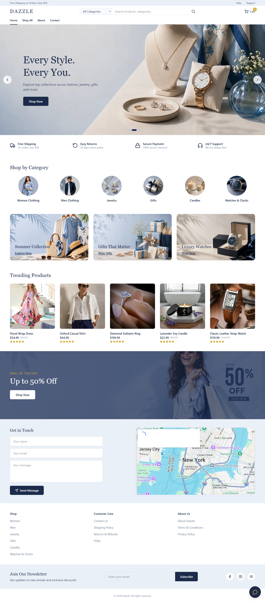
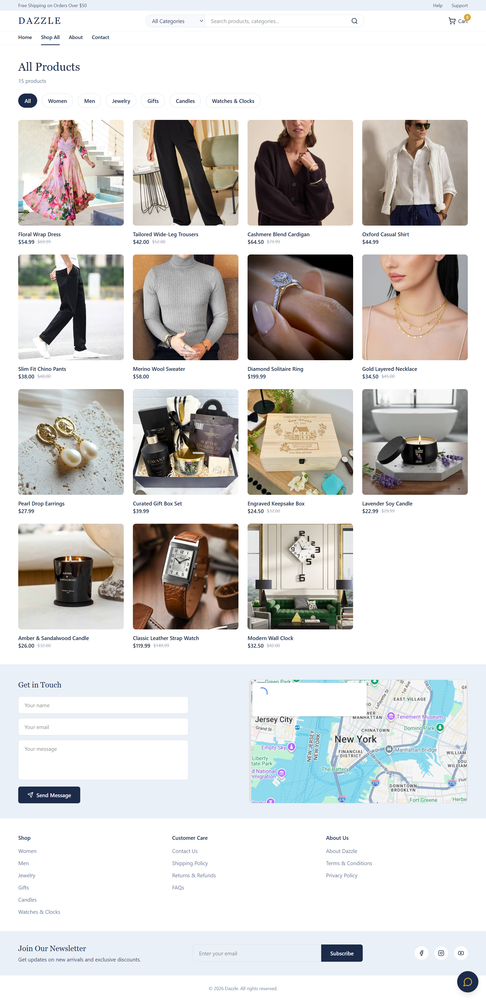
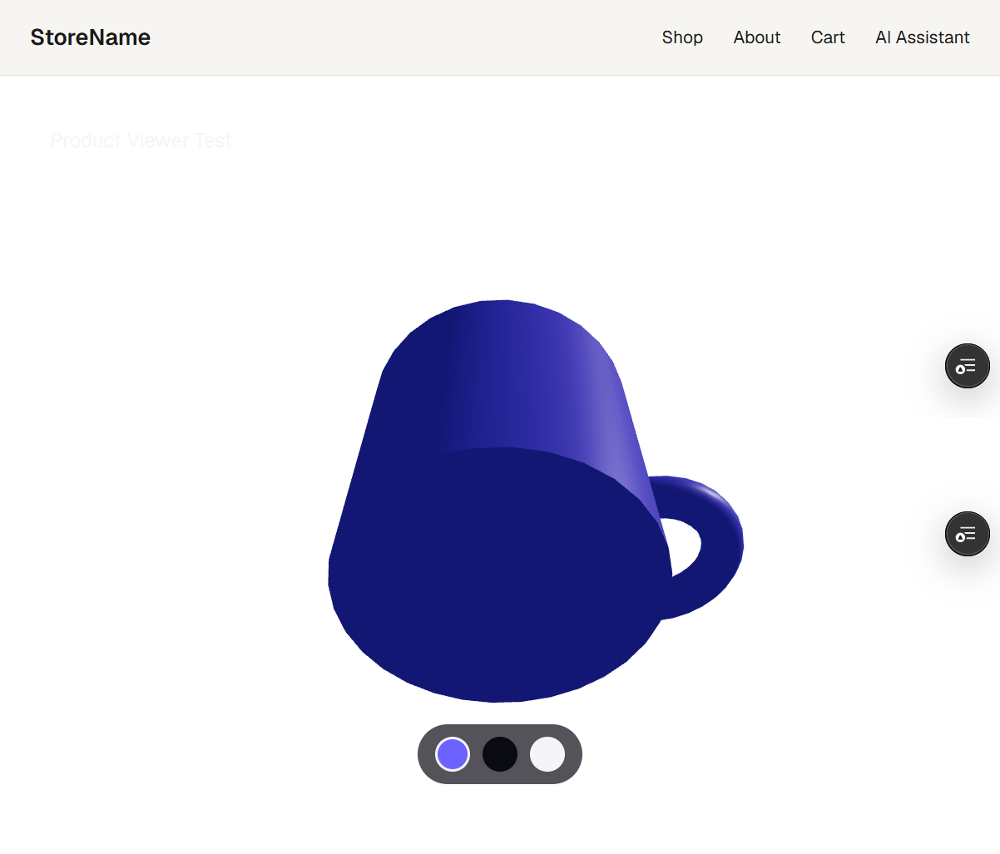

# Dazzle — AI-Powered Shopping Assistant

A Next.js ecommerce storefront with a Gemini-powered AI shopping assistant (floating chat widget + full-page assistant), a 3D product viewer, automated testing, and accessibility auditing. Built as a capstone project for the FlyRank AI Fluency frontend internship program.

**Live site:** https://ecommerce-store-weld-seven.vercel.app/

---

## Screenshots

<!--
Add screenshots to a folder called /screenshots in your repo root, then
reference them below. Take these on your LIVE production URL, not localhost.
Suggested shots: homepage, a product detail page, the floating chat widget
open with a product search result, and the /test-3d viewer.
-->

| Homepage | Product Page | AI Shopping Assistant |
|---|---|---|
|  |  |  |

**3D Product Viewer** (standalone demo at `/test-3d`):



---

## What This Project Does

This is a working ecommerce storefront that lets users:

- Browse a product catalog across six categories (women, men, jewelry, gifts, candles, watches) with category and price filtering, and a working search bar with category dropdown
- Chat with an AI shopping assistant — available both as a full chat page (`/assistant`) and as a floating chat widget accessible from every page — that searches the real product catalog and answers store-policy questions (shipping, returns, payment methods, privacy) based on the store's actual About page content
- Click any product returned by the AI assistant to go straight to that product's detail page
- View an interactive 3D product viewer (rotate, zoom, swap colors) built with React Three Fiber — currently available as a standalone demo page at `/test-3d` rather than linked from individual product pages
- Add items to a cart and walk through checkout
- Get notified via a waitlist form when an out-of-stock item is back

The AI assistant is the centerpiece feature: it uses Google's Gemini 2.5 Flash model via the Vercel AI SDK, with a custom tool (`findProducts`) that lets the model query the real product catalog instead of hallucinating results, plus a system prompt containing the store's real shipping, returns, and privacy policies so it can answer customer-support questions accurately.

---

## Run It Locally

**Prerequisites:** Node.js 18+, npm, a free [Google AI Studio](https://aistudio.google.com/) API key.

```bash
# 1. Clone the repo
git clone https://github.com/habzasaleem/ecommerce-store.git
cd ecommerce-store

# 2. Install dependencies
npm install

# 3. Set up environment variables (see table below)
cp .env.example .env.local
# then open .env.local and paste in your own key

# 4. Run the dev server (webpack mode — see note below)
npm run dev -- --webpack

# 5. Open http://localhost:3000
```

> **Note on `--webpack`:** This project runs Next.js in webpack mode rather than Turbopack. During development, Turbopack caused intermittent `@/` import alias resolution failures on Windows. Webpack resolves this reliably.

### Run tests

```bash
# Unit / component tests (Vitest + React Testing Library)
npm run test

# End-to-end tests (Playwright)
npm run test:e2e
```

Both test suites also run automatically in CI via GitHub Actions on every pull request, and `main` is branch-protected to require passing tests before merge.

---

## Environment Variables

| Variable | Required | Description |
|---|---|---|
| `GOOGLE_GENERATIVE_AI_API_KEY` | Yes | API key for Gemini, used by the AI shopping assistant route. Get one free at [Google AI Studio](https://aistudio.google.com/). |

On Vercel, this is set under **Project → Settings → Environment Variables** for the Production environment (not just in your local `.env.local` file — this was a required step for this deployment, since the app failed on production until the key was added there separately).

---

## Architecture Overview

```
app/
  api/chat/route.js       AI assistant backend — streams responses from Gemini,
                           enforces rate limiting and input length caps, and
                           carries the store's policy knowledge in its system prompt
  assistant/page.jsx      Full-page chat UI, built with the useChat hook (@ai-sdk/react)
  about/page.js            Store policies (shipping, returns, privacy, FAQ) — the
                           same content the AI assistant is briefed on
  search/page.js           Search results page, reads ?q= and ?category= from the URL
  products/                Product listing and detail pages
  test-3d/                 Standalone route for the 3D product viewer
  cart/, checkout/         Cart and checkout flow

components/
  Navbar.jsx                Site navigation, including the working search bar
                           with category dropdown
  ChatWidget.jsx             Floating AI assistant — icon + popup chat available
                           on every page (mounted once in app/layout.js)
  ProductCard.jsx            Product grid item, optimized with next/image and
                           linked to its product detail page
  ProductViewer.jsx           React Three Fiber 3D viewer with orbit controls
  ToolFindProductsDisplay.jsx    Renders the AI assistant's tool-call results
                            (product cards returned by findProducts)
  HeroSlider.jsx, PromoBanners.jsx, CategoryGrid.jsx   Homepage sections, all
                           using next/image for automatic image optimization
  NotifyMeForm.jsx           Waitlist form for out-of-stock items

lib/
  tools/find-products.js   The AI SDK "tool" the model calls to search the
                            real product catalog instead of guessing, with
                            scored matching so a specific product name returns
                            that exact product instead of loosely related items
  products.js               Product data
  ai-config.js               Gemini model configuration

tests/
  *.test.jsx                Component tests (Vitest + RTL)
  assistant-flow.spec.js    End-to-end test (Playwright)
```

**Data flow for the AI assistant (both `/assistant` and the floating widget use the same backend):**

1. User types a message, either in `app/assistant/page.jsx` or in `components/ChatWidget.jsx`
2. `useChat` sends it to `app/api/chat/route.js`
3. The route checks the request against a rate limiter and message-length cap before calling Gemini
4. `streamText` (Vercel AI SDK) calls Gemini 2.5 Flash, giving it access to the `findProducts` tool and a system prompt containing the store's shipping/returns/privacy policies
5. If the model decides to search the catalog, it calls `findProducts`, gets real, scored product matches back, and includes them in its response; if the user asks a policy question, it answers directly from the system prompt
6. The response streams back to the UI and renders as text plus clickable product cards

---

## Key Decisions

- **Gemini 2.5 Flash over GPT-4/Claude for the assistant:** chosen for its free tier and fast response times, which suited a student project with no budget for paid API usage. The trade-off is a stricter free-tier daily quota, which is discussed below.
- **In-memory rate limiting over Redis/Upstash:** the app runs on Vercel's free Hobby plan, so a persistent store like Redis would require a separate paid or third-party service. An in-memory, per-IP limiter needs no extra account and is a legitimate first line of defense, with the known trade-off that counts reset on a cold start.
- **Floating widget on top of the existing `/assistant` page, not instead of it:** rather than replacing the full-page assistant, the widget reuses the same backend and chat logic so both entry points stay in sync with zero duplicated logic.
- **Policy knowledge in the system prompt, not a separate RAG pipeline:** the store's policies are short and static enough to include directly in `route.js`'s system prompt rather than building out embeddings/retrieval infrastructure for a small, fixed set of facts — a deliberately simple solution sized to the actual problem.
- **next/image over plain `` for all homepage and product images:** switching from unoptimized/plain images to `next/image` raised the Lighthouse Performance score from 26 to 95 by enabling automatic resizing, compression, and modern formats.
- **Webpack over Turbopack for local dev:** Turbopack caused intermittent import alias resolution failures on Windows during development; webpack was more reliable.
- **Plain JavaScript over TypeScript:** kept the project in plain JS/JSX throughout, matching the rest of the codebase and avoiding a mid-project migration.

---

## Production Hygiene (Abuse Protection)

The AI assistant route (`app/api/chat/route.js`) is protected against trivial abuse, and this protection covers both the full-page assistant and the floating widget since they share the same backend:

- **Rate limiting:** each visitor (identified by IP) is limited to 10 requests per hour. Requests beyond that receive a `429` response with a clear message rather than reaching the Gemini API.
- **Input length cap:** messages over 500 characters are rejected with a `400` response before being sent to Gemini, preventing oversized requests from burning through API quota or tokens.
- **`maxDuration = 30`:** the streaming route is capped at 30 seconds, so a stuck request can't hang indefinitely.
- **Known limitation:** the rate limiter is in-memory, so it resets when the serverless function cold-starts. It is not a substitute for a persistent store like Redis at real production scale, but is an appropriate and honest trade-off for a free-tier student deployment.

This was tested directly: sending 11 rapid messages correctly triggered the rate limit on the 11th. Separately, real Gemini free-tier quota exhaustion was hit during testing (a genuine `AI_APICallError: quota exceeded` from Google, not a simulated error), which incidentally confirmed the app's error handling surfaces real upstream errors to the user instead of failing silently.

---

## Performance & Accessibility

Lighthouse scores (production URL, mobile):

| Metric | Score |
|---|---|
| Performance | 95 |
| Accessibility | 91 |
| Best Practices | 77 |
| SEO | 100 |

**One concrete improvement made based on audit findings:** the initial Performance score was 26, largely due to a `unoptimized` prop left on the `next/image` component in `ProductCard.jsx` and plain `` tags in the homepage's `HeroSlider`, `PromoBanners`, and `CategoryGrid` components. Removing `unoptimized` and switching all homepage images to `next/image` (with correctly tuned `sizes` attributes) raised the total page payload's image weight dramatically and brought Performance to 95.

<!-- Add axe DevTools or WAVE results here once you run the scan, e.g.:
Accessibility audit (axe DevTools, homepage + product page): 0 critical/serious
violations. [X] moderate issues noted and addressed / documented below. -->

---

## Deployment & Operation

- **Hosting:** Vercel, deployed from the `main` branch (auto-deploys on merge)
- **Branch protection:** `main` requires passing CI (Vitest + Playwright via GitHub Actions) before merge; all changes go through a feature branch → pull request → merge workflow
- **Rollback plan:** if a deployment introduces a regression, revert the offending commit (or the merge commit) on `main` — Vercel automatically redeploys the previous working commit within minutes. No manual server intervention is required.
- **Monitoring:** Vercel's built-in deployment logs and function logs are used to check for runtime errors on the `/api/chat` route; no third-party monitoring service is configured for this student project.
- **Failure states:** the AI assistant shows a designed error state (not a raw crash) when the Gemini API returns an error, when a search returns no matches, and when the rate limit or message-length cap is hit — each has its own message and, where relevant, a retry button.

<!-- Add your filled-out FE-11 deployment checklist here, or link to it if it's a separate file in the repo. -->

---

## How AI Tools Were Used to Build This

This project was built with heavy use of AI coding assistants, and this section is meant to be specific rather than a vague "AI helped build this."

- **Claude** was used throughout development to: scaffold new features (e.g. the 3D product viewer with React Three Fiber, the rate-limiting logic in the AI chat route, the floating chat widget, the search results page), debug real errors encountered during development (e.g. `@/` import alias resolution failures under Turbopack on Windows, async/await issues with `convertToModelMessages()` in AI SDK v7, a product-search matching bug where a specific product name returned unrelated results), and review/fix accessibility and performance issues found during Lighthouse audits (e.g. identifying the `unoptimized` image prop as the root cause of a 26 Performance score).
<!-- ADD ANY OTHER TOOLS YOU USED, e.g. GitHub Copilot, ChatGPT, etc., and specifically what for -->
- Every AI-generated suggestion was run locally (or on the live Vercel deployment) and verified before being committed — nothing was merged without being tested first, including on physical Android devices for the 3D viewer and mobile responsiveness.
- Where AI-generated code had bugs or made incorrect assumptions (for example, initial rate-limiting code that returned JSON errors the frontend didn't unwrap correctly, and a product search tool that matched loosely on any shared keyword instead of prioritizing exact product-name matches), those were caught through manual testing and fixed with follow-up AI-assisted debugging, iterating until the real behavior matched the intended behavior.
- The overall workflow was: decide what a feature or page needs to do → direct an AI tool to generate an implementation → integrate it into the existing codebase → test it for real (locally and on the live deployment) → fix what didn't work → commit.

---

## Tech Stack

- **Framework:** Next.js (App Router, webpack mode)
- **UI:** React, Tailwind CSS
- **AI:** Vercel AI SDK (`ai@7`, `@ai-sdk/react@4`, `@ai-sdk/google@4`), Gemini 2.5 Flash
- **3D:** React Three Fiber, drei, three.js
- **Testing:** Vitest, React Testing Library, Playwright (Chromium)
- **CI/CD:** GitHub Actions, Vercel
- **Validation:** Zod

---

## Known Limitations & Future Improvements

- The 3D product viewer at `/test-3d` is a standalone demo and is not yet linked from individual product detail pages.
- Rate limiting is in-memory and resets on cold starts; a production deployment at real scale would use a persistent store like Upstash Redis.
- Search matching is keyword/scoring-based rather than semantic (vector) search; a specific product name returns an exact match, but more ambiguous natural-language queries rely on term overlap.
- The store currently ships within the United States only (a store policy, not a technical limitation, but worth noting for scope).
- Next planned addition: a separate Laravel/PHP case study project (an AI-powered Learning Management System), to be deployed and documented independently of this repo.

---

## License

<!-- ADD YOUR LICENSE, e.g. MIT, or "Educational project — not licensed for reuse" -->