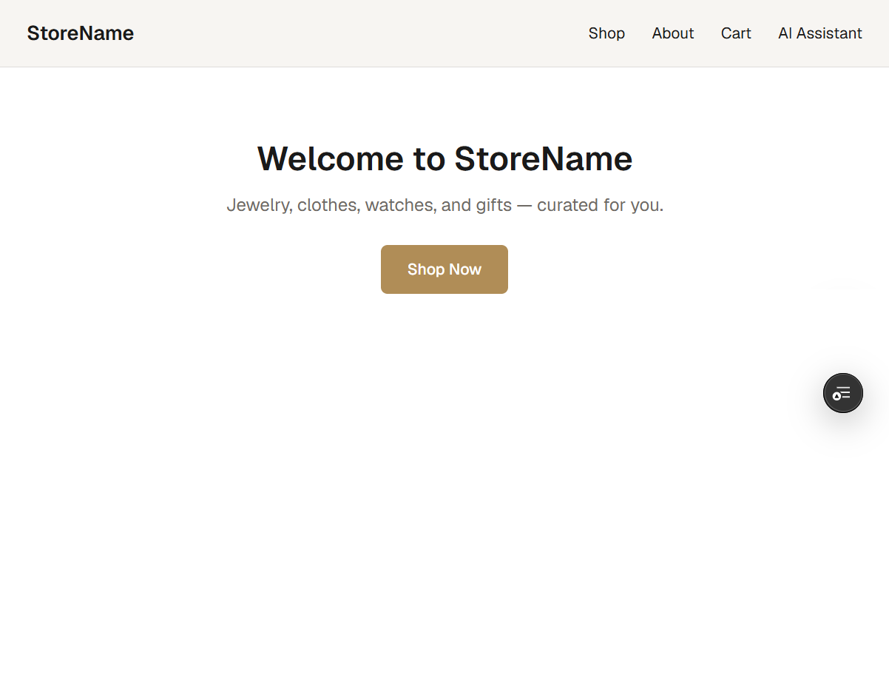
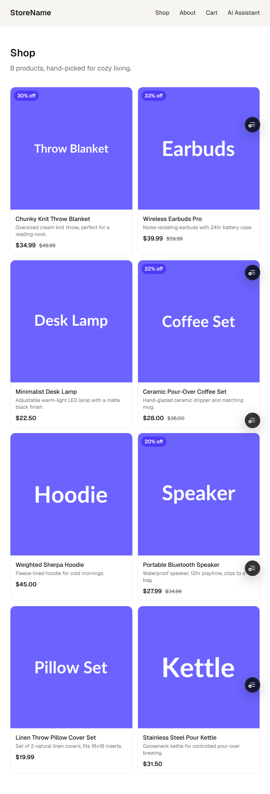
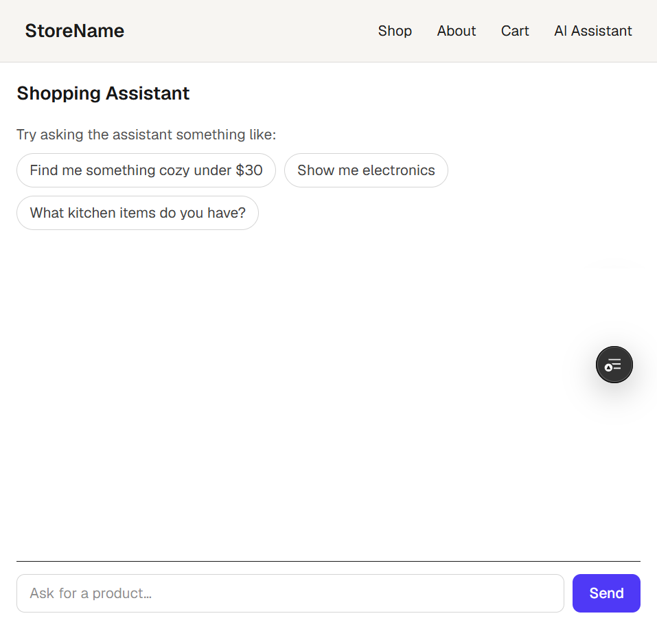

# Ecommerce Store — AI-Powered Shopping Assistant

A Next.js ecommerce storefront with a Gemini-powered AI shopping assistant, a 3D product viewer, automated testing, and accessibility auditing. Built as a capstone project for the FlyRank AI Fluency frontend internship program.

**Live site:** [PASTE YOUR PRODUCTION URL HERE]

---

## Screenshots

<!--
Add screenshots to a folder called /screenshots in your repo root, then
reference them below like this: 
Take these on your live production URL, not localhost.
-->

| Homepage | Product Page | AI Shopping Assistant |
|---|---|---|
|  |  |  |

**3D Product Viewer** (standalone demo at `/test-3d`):


---

## What This Project Does

This is a working ecommerce storefront that lets users:

- Browse a product catalog with category and price filtering
- View an interactive 3D product viewer (rotate, zoom, swap colors) built with React Three Fiber — currently available as a standalone demo page at `/test-3d` rather than linked from individual product pages
- Chat with an AI shopping assistant that searches the product catalog and recommends items based on natural-language requests (e.g. "find me something cozy under $30")
- Add items to a cart and walk through checkout
- Get notified via a waitlist form when an out-of-stock item is back

The AI assistant is the centerpiece feature: it uses Google's Gemini 2.5 Flash model via the Vercel AI SDK, with a custom tool (`findProducts`) that lets the model query the real product catalog instead of hallucinating results.

---

## Run It Locally

**Prerequisites:** Node.js 18+, npm, a free [Google AI Studio](https://aistudio.google.com/) API key.

```bash
# 1. Clone the repo
git clone https://github.com/habzasaleem/ecommerce-store.git
cd ecommerce-store

# 2. Install dependencies
npm install

# 3. Set up environment variables (see table below)
cp .env.example .env.local
# then open .env.local and paste in your own keys

# 4. Run the dev server (webpack mode — see note below)
npm run dev -- --webpack

# 5. Open http://localhost:3000
```

> **Note on `--webpack`:** This project runs Next.js in webpack mode rather than Turbopack. During development, Turbopack caused intermittent `@/` import alias resolution failures on Windows. Webpack resolves this reliably.

### Run tests

```bash
# Unit / component tests (Vitest + React Testing Library)
npm run test

# End-to-end tests (Playwright)
npm run test:e2e
```

Both test suites also run automatically in CI via GitHub Actions on every pull request, and `main` is branch-protected to require passing tests before merge.

---

## Environment Variables

| Variable | Required | Description |
|---|---|---|
| `GOOGLE_GENERATIVE_AI_API_KEY` | Yes | API key for Gemini, used by the AI shopping assistant route. Get one free at [Google AI Studio](https://aistudio.google.com/). |
| `[ADD ANY OTHER ENV VARS YOUR PROJECT USES]` | | |

On Vercel, these are set under **Project → Settings → Environment Variables** for the Production environment (not just in your local `.env.local` file — this was a required step for this deployment, since the app failed on production until the key was added there separately).

---

## Architecture Overview

```
app/
  api/chat/route.js       AI assistant backend — streams responses from Gemini,
                           enforces rate limiting and input length caps
  assistant/page.jsx      Chat UI, built with the useChat hook (@ai-sdk/react)
  products/                Product listing and detail pages
  test-3d/                 Standalone route for the 3D product viewer
  cart/, checkout/         Cart and checkout flow

components/
  ProductCard.jsx          Product grid item
  ProductViewer.jsx         React Three Fiber 3D viewer with orbit controls
  ToolFindProductsDisplay.jsx   Renders the AI assistant's tool-call results
                            (product cards returned by findProducts)
  NotifyMeForm.jsx          Waitlist form for out-of-stock items

lib/
  tools/find-products.js   The AI SDK "tool" the model calls to search the
                            real product catalog instead of guessing
  products.js               Product data
  ai-config.js               Gemini model configuration

tests/
  *.test.jsx                Component tests (Vitest + RTL)
  assistant-flow.spec.js    End-to-end test (Playwright)
```

**Data flow for the AI assistant:**

1. User types a message in `app/assistant/page.jsx`
2. `useChat` sends it to `app/api/chat/route.js`
3. The route checks the request against a rate limiter and message-length cap before calling Gemini
4. `streamText` (Vercel AI SDK) calls Gemini 2.5 Flash, giving it access to the `findProducts` tool
5. If the model decides to search the catalog, it calls `findProducts`, gets real product data back, and includes it in its response
6. The response streams back to the UI and renders as text plus product cards

---

## Key Decisions

- **Gemini 2.5 Flash over GPT-4/Claude for the assistant:** chosen for its free tier and fast response times, which suited a student project with no budget for paid API usage. The trade-off is a stricter free-tier daily quota, which is discussed below.
- **In-memory rate limiting over Redis/Upstash:** the app runs on Vercel's free Hobby plan, so a persistent store like Redis would require a separate paid or third-party service. An in-memory, per-IP limiter needs no extra account and is a legitimate first line of defense, with the known trade-off that counts reset on a cold start.
- **Webpack over Turbopack for local dev:** Turbopack caused intermittent import alias resolution failures on Windows during development; webpack was more reliable.
- **Plain JavaScript over TypeScript:** kept the project in plain JS/JSX throughout, matching the rest of the codebase and avoiding a mid-project migration.

---

## Production Hygiene (Abuse Protection)

The AI assistant route (`app/api/chat/route.js`) is protected against trivial abuse:

- **Rate limiting:** each visitor (identified by IP) is limited to 10 requests per hour. Requests beyond that receive a `429` response with a clear message rather than reaching the Gemini API.
- **Input length cap:** messages over 500 characters are rejected with a `400` response before being sent to Gemini, preventing oversized requests from burning through API quota or tokens.
- **`maxDuration = 30`:** the streaming route is capped at 30 seconds, so a stuck request can't hang indefinitely.
- **Known limitation:** the rate limiter is in-memory, so it resets when the serverless function cold-starts. It is not a substitute for a persistent store like Redis at real production scale, but is an appropriate and honest trade-off for a free-tier student deployment.

This was tested directly: sending 11 rapid messages correctly triggered the rate limit on the 11th. Separately, real Gemini free-tier quota exhaustion was hit during testing (a genuine `AI_APICallError: quota exceeded` from Google, not a simulated error), which incidentally confirmed the app's error handling surfaces real upstream errors to the user instead of failing silently.

---

## How AI Tools Were Used to Build This

This project was built with heavy use of AI coding assistants, and this section is meant to be specific rather than a vague "AI helped build this."

- **Claude** was used throughout development to: scaffold new features (e.g. the 3D product viewer with React Three Fiber, the rate-limiting logic in the AI chat route), debug real errors encountered during development (e.g. `@/` import alias resolution failures under Turbopack on Windows, async/await issues with `convertToModelMessages()` in AI SDK v7), and review/fix accessibility issues found during Lighthouse and WAVE audits.
- **[ADD ANY OTHER TOOLS YOU USED, e.g. GitHub Copilot, ChatGPT, etc., and specifically what for]**
- Every AI-generated suggestion was run locally (or on the live Vercel deployment) and verified before being committed — nothing was merged without being tested first, including on physical Android devices for the 3D viewer and mobile responsiveness.
- Where AI-generated code had bugs or made incorrect assumptions (for example, initial rate-limiting code that returned JSON errors the frontend didn't unwrap correctly, showing raw JSON to the user instead of a clean message), those were caught through manual testing and fixed with follow-up AI-assisted debugging, iterating until the real behavior matched the intended behavior.
- The overall workflow was: decide what a feature or page needs to do → direct an AI tool to generate an implementation → integrate it into the existing codebase → test it for real (locally and on the live deployment) → fix what didn't work → commit.

---

## Tech Stack

- **Framework:** Next.js (App Router, webpack mode)
- **UI:** React, Tailwind CSS
- **AI:** Vercel AI SDK (`ai@7`, `@ai-sdk/react@4`, `@ai-sdk/google@4`), Gemini 2.5 Flash
- **3D:** React Three Fiber, drei, three.js
- **Testing:** Vitest, React Testing Library, Playwright (Chromium)
- **CI/CD:** GitHub Actions, Vercel
- **Validation:** Zod

---

## License

[ADD YOUR LICENSE, e.g. MIT, or "Educational project — not licensed for reuse"]